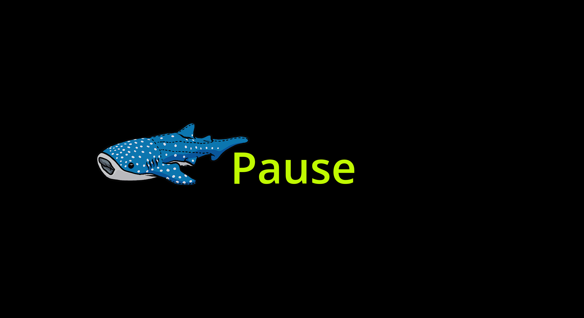
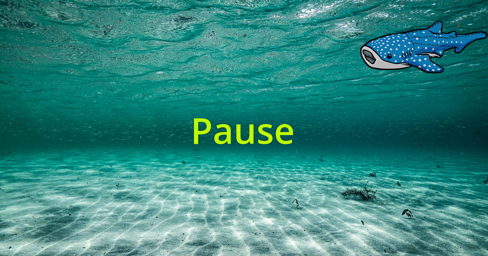

# Walter ScreenSaver v1.0.0.2
Walter der Walhai, ein DVD-Logo Ersatz für den Livestream von @EhrlichUnehrlich

## System
Windows 10/11 x64. Wer einen Mac hat, kann natürlich die Godot 4.5-Dateien nehmen und einen eigenen Build erstellen.
Eine Linux-Version gibt es auch als Release.

## Auflösung
1920x1080 FullHD (default, Fullscreen)
1280x720 (windowed, resizable)

## Tastaturbelegung
* ESC	:		Programm beenden
* PageDown :	Fenstermodus
* PageUp :		Vollbild
* 1 :			Hintergrund 1 (schwarz)
* 2 :			Hintergrund 2 (Unterwasser)
* Pfeil hoch : Winkel hoch
* Pfeil runter : Winkel runter
* P : Pause-Label anzeigen/nicht anzeigen (default: eingeschaltet)
* Plus : Geschwindigkeit von Walter erhöhen
* Minus : Geschwindigkeit von Walter niedriger

### Software
Godot 4.5 Mono (C#)

### Lizenz
GPL v3

### Copyright Walhai Walter
Der Walhai Walter gehört Frau Ehrlich Unehrlich. Die Verwendung ist nur mit ihrem Einverständnis erlaubt.

### Screenshots

### Links
* YouTube: https://www.youtube.com/@EhrlichUnehrlich/featured
* Reddit: https://www.reddit.com/r/EhrlichUnehrlich/
