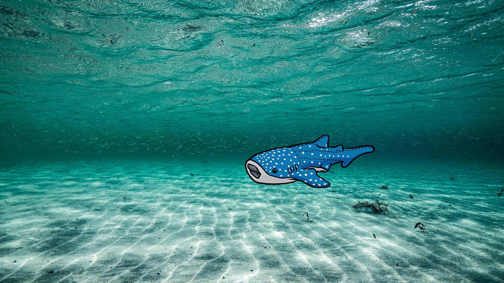

# Walter ScreenSaver
Walter der Walhai, ein DVD-Logo Ersatz für den Livestream von @EhrlichUnehrlich

## System
Erstmal nur für Windows 10/11 x64. Wer einen Mac oder Linux-PC hat, kann natürlich die Godot 4.5-Dateien nehmen und einen eigenen Build erstellen.

## Auflösung
1920x1080 FullHD (default, Fullscreen)
1280x720 (windowed, resizable)

## Tastaturbelegung
-ESC			Programm beenden
-PageDown	Fenstermodus
-PageUp		Vollbild
-1			Hintergrund 1 (schwarz)
-2 			Hintergrund 2 (Unterwasser)

### Software
Godot 4.5 Mono (C#)

### Lizenz
GPL v3

### Copyright Walhai Walter
Der Walhai Walter gehört Frau Ehrlich Unehrlich. Die Verwendung ist nur mit ihrem Einverständnis erlaubt.

### Screenshots

